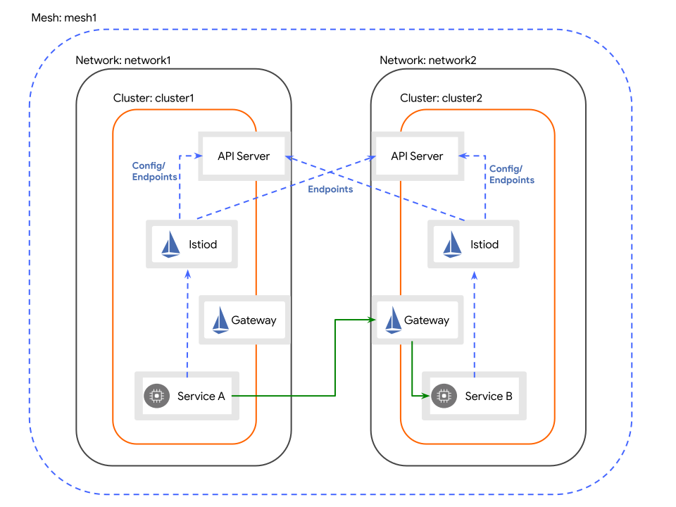

# Istio Multi-Cluster East-West Debugging Guide

A comprehensive reference for debugging cross-cluster service discovery and endpoint propagation issues in an Istio multi-network, multi-primary setup.



<!-- more -->

## Context

This guide was written while debugging a specific issue: in a multi-primary, multi-network setup between two clusters (`cluster-2` and `cluster-1`), services from the remote cluster were being **discovered** but their **endpoints were not appearing** in local sidecars, causing 503 errors.

The root cause turned out to be that **MCS (Multi-Cluster Services) mode was accidentally enabled** on istiod, causing remote endpoints to be registered under `*.svc.clusterset.local` hostnames instead of `*.svc.cluster.local`. This guide documents the debugging journey and all the useful commands along the way.

---

## Setup Summary

- Two clusters: `cluster-2` (context: `home`) and `cluster-1` (context: `bare`)
- Istio multi-primary, multi-network topology
- East-West gateways on both clusters
- A test service `test-east-west` in the `mesh` namespace on both clusters
- `discoverySelectors` configured to sync namespaces with `topology.divar.ir/east-west=true`

---

## The Debugging Ladder

When a service is discovered but has no endpoints in the sidecar, work through these steps in order:

1. **Do Kubernetes endpoints exist on the source cluster?**
2. **Is Istiod connected to the remote cluster?**
3. **Is Istiod reading the remote endpoints?**
4. **Under what hostname is Istiod registering them?**
5. **Is Istiod pushing them via EDS?**
6. **Did the sidecar receive them?**
7. **Can the sidecar reach them?**

---

## 1. Verify Kubernetes Endpoints on the Source Cluster

Before blaming Istio, make sure Kubernetes itself has discovered the pods backing the service.

```bash
kubectl --context=bare get endpointslices -n mesh -l kubernetes.io/service-name=test-east-west
```

**Expected:** An `EndpointSlice` with one or more IP addresses.

```
NAME                   ADDRESSTYPE   PORTS   ENDPOINTS       AGE
test-east-west-jzz8g   IPv4          5000    10.235.66.187   4h48m
```

If this is empty, the issue is with your `Service` selector or pod readiness — not Istio.

---

## 2. Verify Istiod's Remote Cluster Connection

Istiod must be connected to the remote cluster's API server to discover its services and endpoints.

### Check the remote secret

```bash
kubectl --context=home get secret -n istio-system -l istio/multiCluster=true \
  -o jsonpath="{range .items[*]}{.metadata.name}{'\t'}{.metadata.labels.istio/multiCluster}{'\t'}{.metadata.labels.topology\.istio\.io/cluster}{'\n'}{end}"
```

**Expected:** Each secret must have the `topology.istio.io/cluster` label set to the cluster name referenced in `meshNetworks`.

```
istio-remote-secret-cluster-1    true    cluster-1
```

> ⚠️ If the `topology.istio.io/cluster` label is missing, Istiod may register endpoints under the wrong cluster name. Add it with:
> ```bash
> kubectl --context=home label secret -n istio-system istio-remote-secret-cluster-1 \
>   topology.istio.io/cluster=cluster-1
> ```

### Check that Istiod has synced both clusters

```bash
kubectl --context=home exec -n istio-system deploy/istiod -- \
  curl -s localhost:15014/debug/clusterz
```

**What it shows:** All Kubernetes clusters Istiod is watching, including the local one and any remote ones loaded via remote secrets.

**Expected:** Both clusters listed with `syncStatus: synced`.

```json
[
  {"id":"cluster-2","secretName":"","syncStatus":"synced"},
  {"id":"cluster-1","secretName":"istio-system/istio-remote-secret-cluster-1","syncStatus":"synced"}
]
```

If `syncStatus` is not `synced`, check the kubeconfig in the remote secret and the RBAC permissions of the service account it represents.

---

## 3. Verify Service Discovery via `registryz`

```bash
kubectl --context=home exec -n istio-system deploy/istiod -- \
  curl -s localhost:15014/debug/registryz | \
  jq -r '.[] | select(.Attributes.Name == "test-east-west")'
```

**What it shows:** Every service Istiod knows about, regardless of source cluster.

**Expected:** The service entry should contain `clusterVIPs` for **both** clusters:

```json
"clusterVIPs": {
  "Addresses": {
    "cluster-2": ["10.236.80.97"],
    "cluster-1": ["10.235.3.92"]
  }
}
```

If only one cluster appears here, the remote registry isn't seeing this namespace/service. Check `discoverySelectors` and the namespace labels.

---

## 4. Verify Endpoint Discovery via `endpointShardz` ⭐

**This is the most important step for our class of issue.** It shows the raw per-cluster endpoint shards that Istiod has read from each Kubernetes registry, *before* any pushing to sidecars.

### Always dump the full keys first

```bash
kubectl --context=home exec -n istio-system deploy/istiod -- \
  curl -s 'localhost:15014/debug/endpointShardz' | jq '.shards | keys' | grep test-east-west
```

**Why dump keys first:** the same logical service may exist under multiple hostnames (`*.svc.cluster.local`, `*.svc.clusterset.local`, etc.). If you `grep` only for the hostname you expect, you'll miss MCS-style registrations.

**Expected (in normal multi-primary):**
```
"test-east-west.mesh.svc.cluster.local"
```

**What we actually saw (indicating MCS was on):**
```
"test-east-west.mesh.svc.cluster.local"
"test-east-west.mesh.svc.clusterset.local"   ← endpoints went here!
```

### Then inspect the shards

```bash
kubectl --context=home exec -n istio-system deploy/istiod -- \
  curl -s 'localhost:15014/debug/endpointShardz' | \
  jq '.shards | with_entries(select(.key | contains("test-east-west")))'
```

**Expected:** A shard per cluster (`Kubernetes/cluster-2`, `Kubernetes/cluster-1`) under the `cluster.local` hostname, each containing pod IPs with their network labels:

```json
{
  "test-east-west.mesh.svc.cluster.local": {
    "mesh": {
      "Shards": {
        "Kubernetes/cluster-1": [
          {
            "Addresses": ["10.235.66.187"],
            "Network": "cluster-1",
            "Locality": {"Label": "tehran/cluster-1/", "ClusterID": "cluster-1"},
            ...
          }
        ]
      }
    }
  }
}
```

If shards appear under `clusterset.local` instead of `cluster.local`, you're in MCS mode. See [§9 MCS Pitfall](#9-the-mcs-pitfall-the-actual-root-cause).

If no shards appear at all, Istiod isn't reading endpoints from the remote cluster — check RBAC on the remote service account.

---

## 5. Verify Istiod's EDS Push

After Istiod reads endpoints from K8s, they must be packaged into EDS responses for sidecars.

```bash
kubectl --context=home exec -n istio-system deploy/istiod -- \
  curl -s localhost:15014/debug/edsz | jq -r '.[].name' | grep test-east-west
```

**What it shows:** The names of all EDS clusters Istiod will push to proxies.

**Expected:**
```
outbound|80||test-east-west.mesh.svc.cluster.local
```

If this is missing, Istiod has the endpoints but isn't building an EDS cluster for them — usually a config issue (e.g., misconfigured `Sidecar` or `ServiceEntry`).

---

## 6. Verify Sidecar Sync State

```bash
kubectl --context=home exec -n istio-system deploy/istiod -- \
  curl -s localhost:15014/debug/syncz | \
  jq '.[] | select(.proxy | contains("netshoot"))'
```

**What it shows:** XDS sync status (CDS, EDS, LDS, RDS) for each connected proxy.

**Expected:** All four should be `SYNCED`.

If something is `STALE` or not synced, the sidecar isn't receiving updates and the issue may be on the data-plane side.

---

## 7. Verify the Sidecar's View

### Check the cluster exists

```bash
istioctl --context=home proxy-config cluster \
  "$(khome -n mesh get po -lapp=netshoot --no-headers | awk '{print $1}')".mesh | \
  grep test-east-west
```

**Expected:** A single line for the cluster.

> ⚠️ If you see two lines — one for `cluster.local` and one for `clusterset.local` — that's the MCS smoking gun visible from the data plane.

### Check the endpoints

```bash
istioctl --context=home proxy-config endpoints \
  "$(khome -n mesh get po -lapp=netshoot --no-headers | awk '{print $1}')".mesh \
  --cluster "outbound|80||test-east-west.mesh.svc.cluster.local"
```

**Expected in multi-network mode:** The endpoint IP should be the **East-West gateway IP of the remote cluster**, *not* the pod IP. This is how Istio handles multi-network routing — traffic is sent to the remote gateway, which terminates and forwards to the actual pod.

```
ENDPOINT              STATUS      CLUSTER
172.21.209.80:443     HEALTHY     outbound|80||test-east-west.mesh.svc.cluster.local
172.21.209.81:443     HEALTHY     outbound|80||test-east-west.mesh.svc.cluster.local
```

If empty: the sidecar has the cluster but no endpoints — work backwards through `edsz` → `endpointShardz`.

### Or dump everything

```bash
istioctl --context=home proxy-config all \
  "$(khome -n mesh get po -lapp=netshoot --no-headers | awk '{print $1}')".mesh \
  -o json | grep -i clusterset
```

Any hit on `clusterset` is a sign that MCS mode is leaking into the data plane.

---

## 8. Inspect the Sidecar Directly (Envoy Admin Interface)

When you don't want to trust istiod's view of what was sent, ask Envoy itself.

```bash
kubectl --context=home exec -n mesh \
  "$(khome -n mesh get po -lapp=netshoot --no-headers | awk '{print $1}')" \
  -c istio-proxy -- curl -s localhost:15000/clusters | grep test-east-west
```

**What it shows:** The actual cluster state in the Envoy proxy, including endpoint counts, success/failure stats, and outlier detection state.

Useful fields:
- `membership_total` = number of endpoints in the cluster. `0` means EDS sent an empty list.
- `cx_active`, `cx_total` = active and total connections.
- `health_flags` = per-endpoint health.

```bash
kubectl --context=home exec -n mesh "<pod>" -c istio-proxy -- \
  curl -s localhost:15000/config_dump | grep -i clusterset
```

Confirms whether the data plane has any `clusterset.local` artifacts.

---

## 9. The MCS Pitfall (The Actual Root Cause)

### Symptom

- Services appear in `registryz` with `clusterVIPs` from both clusters.
- `endpointShardz` has the remote shards — but under `*.svc.clusterset.local`, not `*.svc.cluster.local`.
- Istiod logs show:
  ```
  Incremental push, service test-east-west.mesh.svc.cluster.local at shard Kubernetes/cluster-2 has no endpoints
  Incremental push, service test-east-west.mesh.svc.clusterset.local at shard Kubernetes/cluster-2 has no endpoints
  ```
- Sidecar's `cluster.local` Envoy cluster has zero endpoints.

### Why this happens

Istiod has MCS feature flags enabled:
- `ENABLE_MCS_HOST=true`
- `ENABLE_MCS_CLUSTER_LOCAL=true`
- `ENABLE_MCS_SERVICE_DISCOVERY=true`

When MCS mode is active, Istiod treats remote services as MCS-exported and registers them under the `*.svc.clusterset.local` hostname. Your local sidecar requests `cluster.local`, but the endpoints live under `clusterset.local`, so they never connect.

### Check if MCS is on

```bash
kubectl --context=home exec -n istio-system deploy/istiod -- env | grep -iE "mcs|cluster|network|pilot"
```

If you see any `ENABLE_MCS_*=true`, that's the problem.

### Fix

Remove the env vars (e.g. if they were added with `kubectl edit` or `set env` outside of Helm):

```bash
kubectl --context=home -n istio-system set env deployment/istiod \
  ENABLE_MCS_HOST- \
  ENABLE_MCS_CLUSTER_LOCAL- \
  ENABLE_MCS_SERVICE_DISCOVERY-
```

(The trailing `-` after each name removes the variable.)

> 💡 **Helm gotcha:** If you `kubectl edit`-ed env vars into a deployment that Helm manages, `helm upgrade` will **not** remove them. Helm only removes fields it set itself in a previous release. Either remove them manually or declare them in your Helm values explicitly so Helm owns them.

---

## 10. Reading Access Log Response Flags

When debugging 503s, Envoy's response flags in access logs immediately narrow down the issue:

| Flag | Meaning | Likely Cause |
|------|---------|--------------|
| `UH` | No healthy upstream | Cluster exists, no endpoints — registry/EDS mismatch |
| `NR` | No route | No matching listener/route — hostname mismatch or missing `VirtualService` |
| `UF` | Upstream connection failure | Endpoints exist but unreachable — gateway/network issue |
| `UC` | Upstream connection termination | Connection dropped mid-flight |
| `URX` | Retries exhausted | Repeated upstream failure |

In our case, requests would have shown `UH` — meaning the cluster existed but had no usable endpoints — pointing directly to an EDS/registry issue.

[Here](https://www.envoyproxy.io/docs/envoy/latest/configuration/advanced/substitution_formatter.html) is the documentation for the response flags.

---

## 11. Comparing With a Known-Good Cluster

If you have an old cluster that worked, diff the istiod resources:

```bash
diff <(kubectl --context=old-cluster-2 -n istio-system get deploy istiod -o yaml) \
     <(kubectl --context=home   -n istio-system get deploy istiod -o yaml)
```

```bash
diff <(kubectl --context=old-cluster-2 -n istio-system get cm istio -o yaml) \
     <(kubectl --context=home   -n istio-system get cm istio -o yaml)
```

This would have immediately revealed the manually-added MCS env vars.

---

## 12. Full List of Useful Istiod Debug Endpoints

To enumerate everything available:

```bash
kubectl --context=home exec -n istio-system deploy/istiod -- curl -s localhost:15014/debug
```

The endpoints most relevant to multi-cluster debugging:

| Endpoint | What it shows |
|---|---|
| `/debug/clusterz` | All connected K8s clusters and their sync status |
| `/debug/registryz` | All services discovered, including per-cluster VIPs |
| `/debug/endpointShardz` | Raw per-cluster endpoint shards (pre-push) ⭐ |
| `/debug/edsz` | EDS resources Istiod pushes to sidecars |
| `/debug/syncz` | XDS sync state of every proxy |
| `/debug/configz` | Full mesh configuration |
| `/debug/push_status` | Last push's errors and warnings |
| `/debug/instancesz` | Workload instances per service |
| `/debug/authorizationz` | Authorization policy state |

---

## TL;DR Diagnostic Flow

```
Service is discovered but no endpoints in sidecar
                  │
                  ▼
   [1] kubectl get endpointslices  ← K8s side OK?
                  │
                  ▼
   [2] /debug/clusterz             ← Remote cluster synced?
                  │
                  ▼
   [3] /debug/registryz            ← Service known with both clusterVIPs?
                  │
                  ▼
   [4] /debug/endpointShardz       ← ⭐ Endpoints exist under expected hostname?
        keys first, then inspect       (clusterset.local => MCS issue)
                  │
                  ▼
   [5] /debug/edsz                 ← EDS cluster being built?
                  │
                  ▼
   [6] /debug/syncz                ← Proxy is in sync?
                  │
                  ▼
   [7] istioctl pc cluster/endpoints  ← Sidecar received correct config?
                  │
                  ▼
   [8] Envoy /clusters /config_dump   ← Data plane actually has it?
```

---

## Lessons Learned

1. **Always dump full keys first.** When something is "missing", it's often present under a slightly different name. Filtering on assumed hostnames hid the `clusterset.local` registration for a while.
2. **`endpointShardz` is the single most informative endpoint** for "service discovered but no endpoints" issues.
3. **Check istiod env vars early.** Manual edits via `kubectl edit` survive Helm upgrades silently.
4. **Don't trust the control plane alone.** Compare istiod's view (`edsz`) with what the data plane has (`/clusters`).
5. **Response flags (`UH`, `NR`, `UF`) are gold.** They split the diagnostic tree before any debug endpoints are needed.