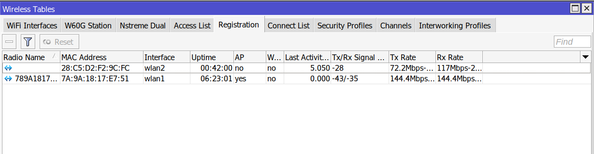
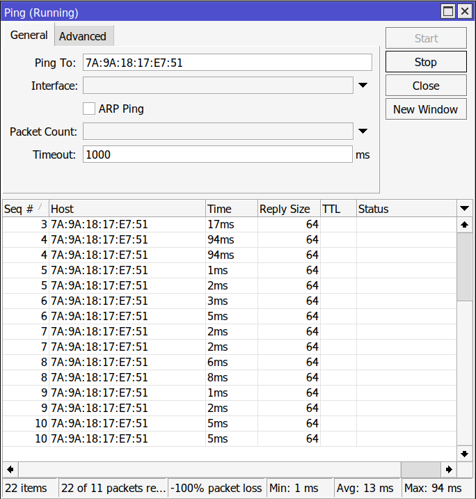
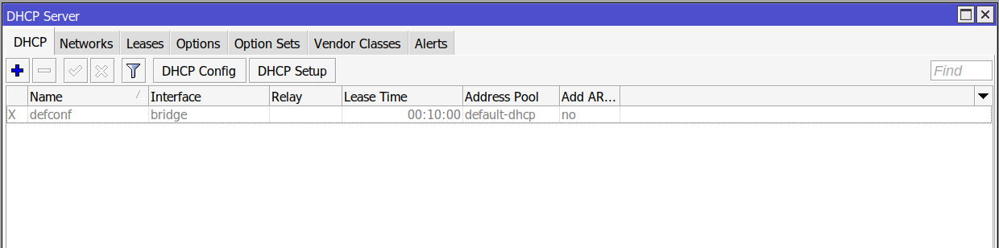
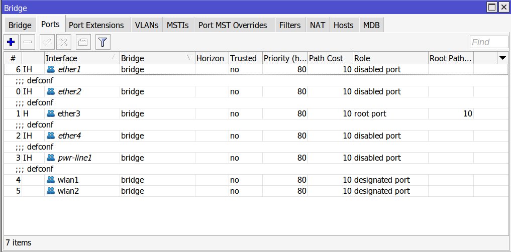

# Use a Mikrotik as a Repeater

A mikrotik can be used as a repeater to widen the range of wifi reachability. Here is a how to to setup and troubleshoot mikrotik repeater.

<!-- more -->

Setting up a Mikrotik as a repeater is as easy as connecting to an ordinary router in other devices.
The only thing you need to do is to connect to router admin interface, go to wireless settings and click on "Setup Repeater" button.

In the opened window, we should first write the SSID, and in `Passphrase` field we should write the password of the router we want to connect to. After that, it tries to connect to the router and if everything is ok, there should be a new virtual interface created (like image above).  

## What happens underneath?

This `Setup Repeater` button is like a wizard tool that does the work.  
First, it changes some of the configurations on the wireless interface. For example, it sets the `Mode` to `station bridge`. Also, it sets the SSID to the SSID of the main router.  
Then it makes a virtual interface with the same name and the `Mode` being `ap bridge`.  
Authentication information in mikrotik are stored as `Security Profiles`. `Setup Repeater` also makes a new security profile with `<SSID>-repeater` name which saves the authentication information for the main router.  

## Troubleshooting

One of the signs that the repeater is setup correctly is that in the `Registration` tab, we should see our virtual interfaces:

Also, by clicking on the `wlan1` which is the interface that is connected to the upstream router, there is `MAC Ping` option that can be used to check if there is layer 2 connectivity between the repeater ans the upstream router (Normal ping doesn't help because it uses the `last ip` value which is an ip public, perhaps the destination ip of the traffic that is going through the repeater. Also it changes each second).

If we want to setup the repeater as layer 2 repeater, we should disable the `DHCP Server` on the repeater mikrotik. If we don't do this, the repeater will try to assign IP addresses to the devices connected to it, Even though clients should get their IP addresses from the main router.

Another problem can be due to the isolation of an interface. For an interface to work in repeater setup, it should be included and enabled in `Bridge` ports. This can be check by going to `Bridge` section from the left menu and checking the `Port` tab.

